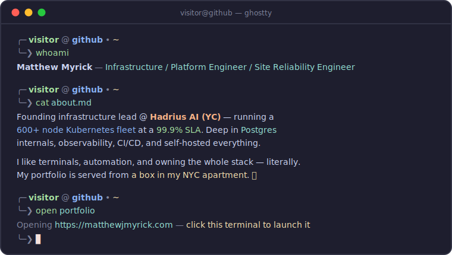

### **[matthewjmyrick.com](https://matthewjmyrick.com)** — an interactive terminal you can actually use

---

### 

### 

| repo | what it is |
|---|---|
| 🔍 [git-diffs](https://github.com/matthewmyrick/git-diffs) | Full-screen TUI for git diffs between branches — side-by-side view, syntax highlighting, fuzzy search (Go) |
| 🐧 [catch-pokemon](https://github.com/matthewmyrick/catch-pokemon) | Terminal Pokémon catching game with weighted encounters, animated ASCII art, and signed save storage (Rust/Go) |
| ⚡ [azure-searcher](https://github.com/matthewmyrick/azure-searcher) | Blazing-fast Azure resource explorer TUI — parallel fetching + smart caching (Go) |
| 🖥️ [portfolio-site](https://github.com/matthewmyrick/portfolio-site) | This terminal-style portfolio — React/TS/Vite over a virtual filesystem, self-hosted from my home lab |

### 

🏡 <i>There's no place like 127.0.0.1 — this profile pairs well with the real terminal at <a href="https://matthewjmyrick.com">matthewjmyrick.com</a></i>

